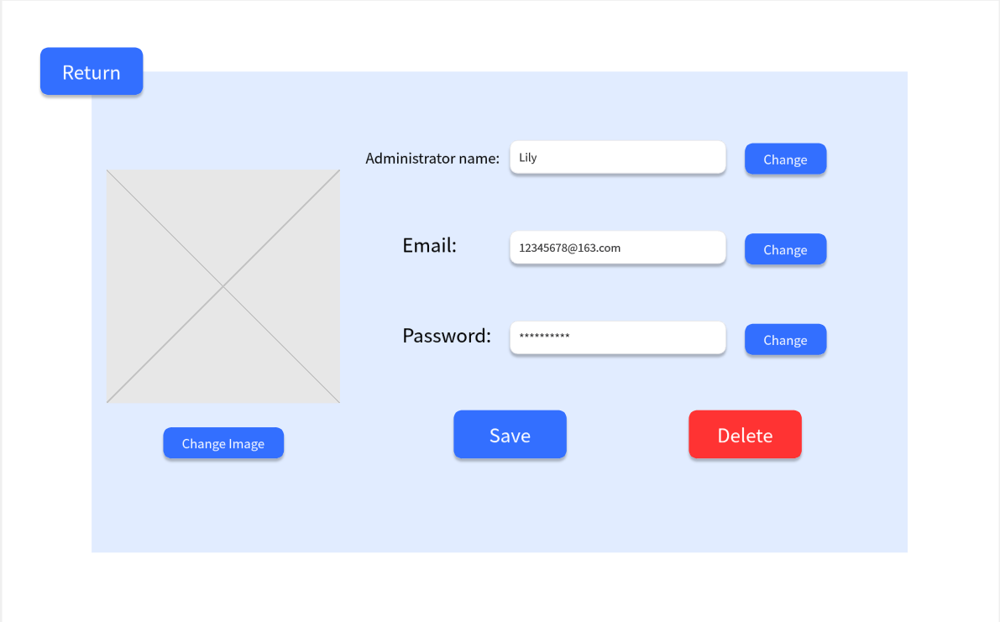
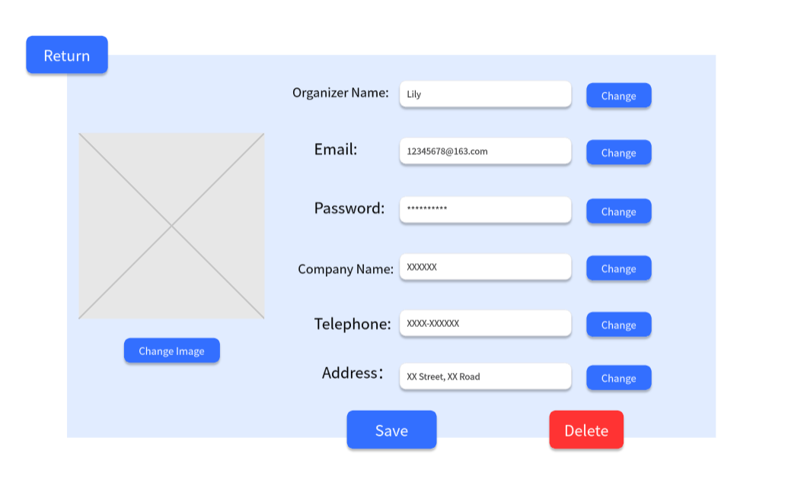

# Use Case 01 - Create Account

## Description

Allows the administrator to create a new administrator or organiser account

## Actors

Administrator

## Triggers

This use case is triggered when a new administrator or organiser account is needed

## Preconditions

- The is on the administrator list accounts page (04-list-accounts)

## Postconditions

- The administrator is returned to the view account page of the system (12-view&modify-account-admin-admin/15-view&modify-account-admin-organiser) which shows the details of the created account

## Courses of Events

### Basic Course of Events

1. The administrator selects the create account functionality
2. The system displays an input form to get the required details (details required are based on the type of account being created) - 05-create-account
3. The administrator enters the details of the account
4. The system displays the view account page with the details of the created account shown - 12-view&modify-account-admin-admin/15-view&modify-account-admin-organiser

### Alternative Courses of Events - Account Already Exists

1. The administrator selects the create account functionality
2. The system displays an input form to get the required details (details required are based on the type of account being created) - 05-create-account
3. The administrator enters the details of the account
4. The system displays an error message indicating that the account already exists
5. The administrator clicks OK
6. The system returns to the create account page - 05-create-account

### Alternative Courses of Events - Invalid Input

1. The administrator selects the create account functionality
2. The system displays an input form to get the required details (details required are based on the type of account being created) - 05-create-account
3. The administrator enters the details of the account
4. The system displays an error message indicating that some inputs are invalid
5. The administrator clicks OK
6. The system returns to the create account page - 05-create-account

### Extension Points

None

## Inclusions

None

## Relevant UI Sketches
| Page Name               | Image                                                                                          |
|-------------------------|------------------------------------------------------------------------------------------------|
| List Accounts Page      |                                                  |
| Create Account Page     |                                                |
| View Account Page (Admin-Admin)       |  |
| View Account Page (Admin-Organiser) |  |
| Duplicate Email Message |         |
| Missing Details Message |  |

## Data Outcomes
**CREATE** - A new account will be created and added to the system

**READ** - The details of the newly created account will be read and displayed
