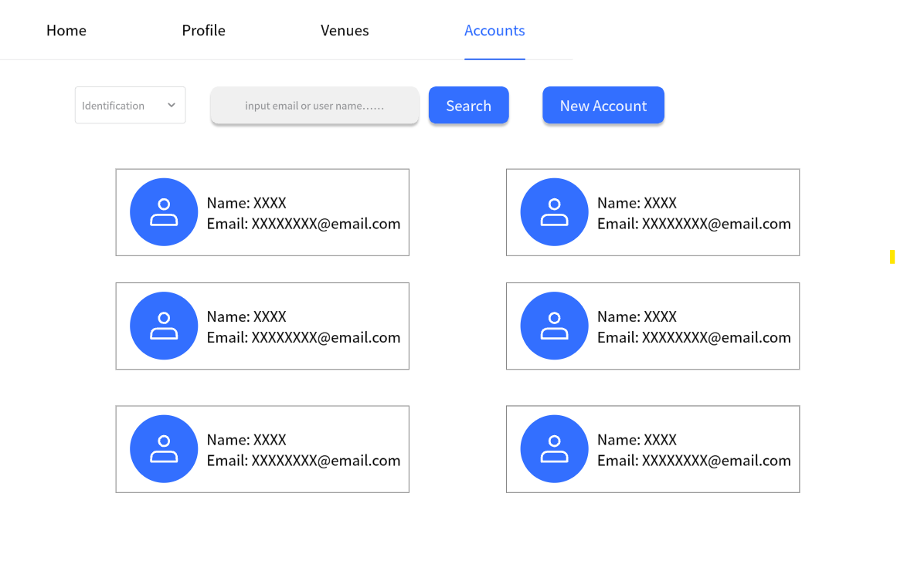

# Use Case 03 - View Account

## Description

Allows the administrator to view the details of an account in the system.
Allows the organiser and the user to view the details of their account in the system.
## Actors

Administrator, Organizer, User

## Triggers

This use case is triggered when the administrator needs to view the details of an account in the system and the organiser and the user needs to view the details of their account in the system.
## Preconditions

- The administrator is on the list accounts page (04-list-accounts)
- The administrator, organiser or user is the home page for their account type (01-main-admin, 02-main-organiser, 03-main-user)

## Postconditions

- The administrator is shown the view account page (06-view&modify-account-admin-user, 12-view&modify-account-admin-admin, 15-view&modify-account-admin-organiser) which shows the details of the selected account
- The administrator, organiser or user is shown the view account page (16-profile-admin, 21-profile-organiser, 08-profile-user) which shows the details of their account

## Courses of Events

### Basic Course of Events - Administrator Viewing Other Accounts

1. The administrator selects the view account functionality adjacent to the account to view
2. The system displays the view account page (06-view&modify-account-admin-user, 12-view&modify-account-admin-admin, 15-view&modify-account-admin-organiser) which shows the details of the selected account

### Basic Course of Events - Administrator, Organiser or User Viewing Their Account

1. The administrator, organiser or user selects the own account functionality on the main page for their account type
2. The system displays the view account page (16-profile-admin, 21-profile-organiser, 08-profile-user) which shows the details of the selected account

### Extension Points

None

## Inclusions

Account retrieval operations for email, username, and password.

## Relevant UI Sketches
| Page Name                           | Image                                                               |
|-------------------------------------|---------------------------------------------------------------------|
| Main Admin Page                     |                             |
| Main Organiser Page                 |                     |
| Main User Page                      |                               |
| List Accounts Page                  |                       |
| View Account Page (Admin-User)      |       |
| View Account Page (Admin-Admin)     |      |
| View Account Page (Admin-Organiser) |  |
| View Account Page (Admin)           |                        |
| View Account Page (Organiser)       |                    |
| View Account Page (User)            |       |

## Data Outcomes
**READ** - The details of the selected account will be read and displayed

