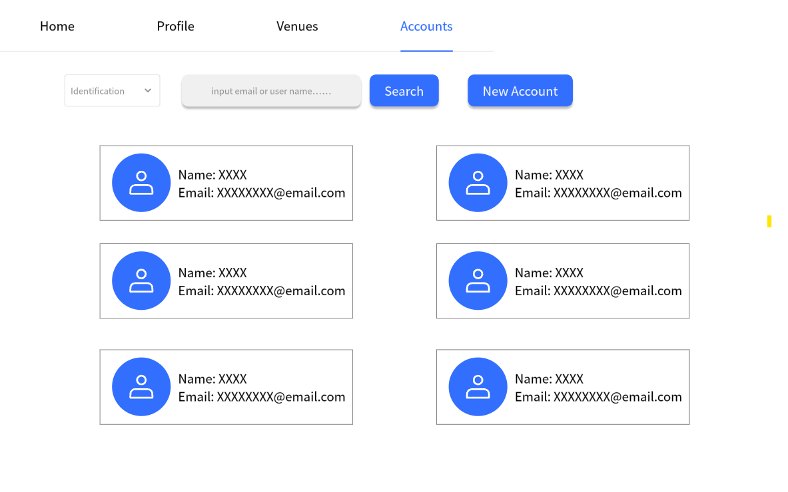
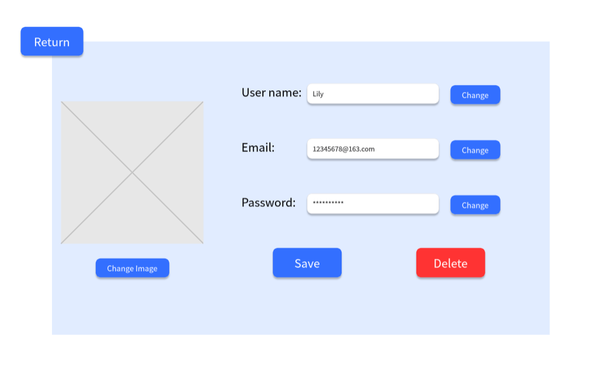
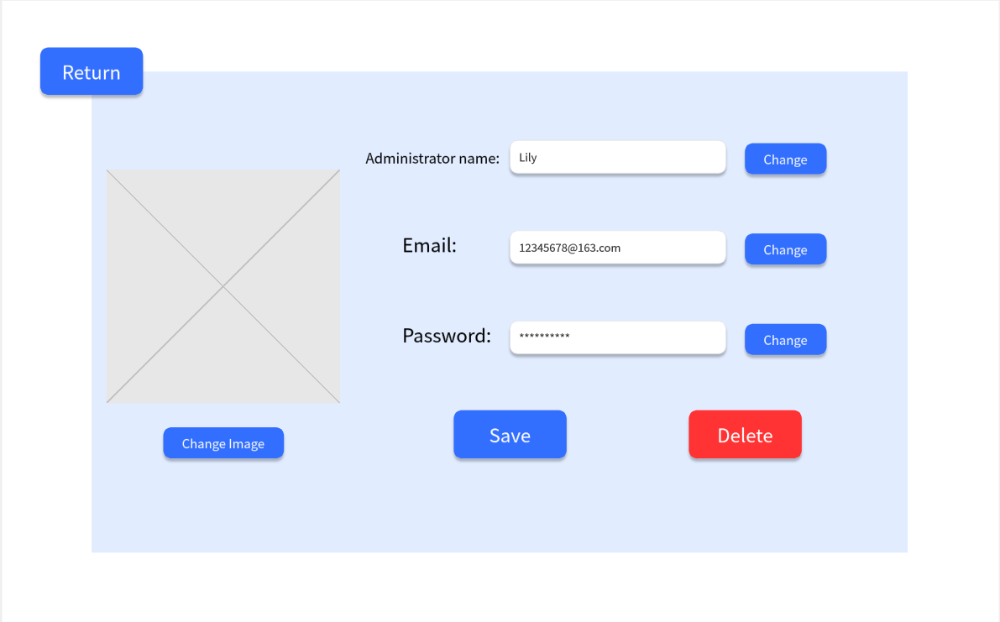
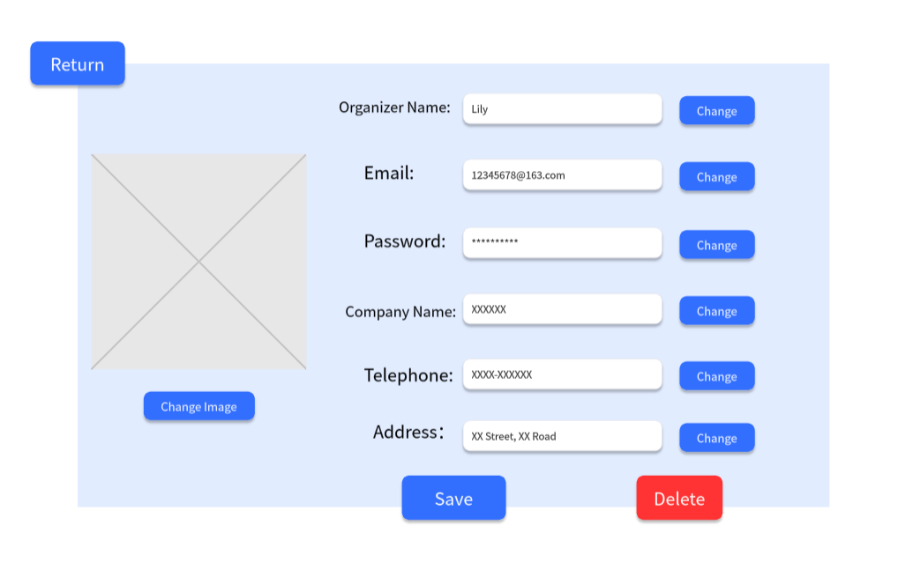
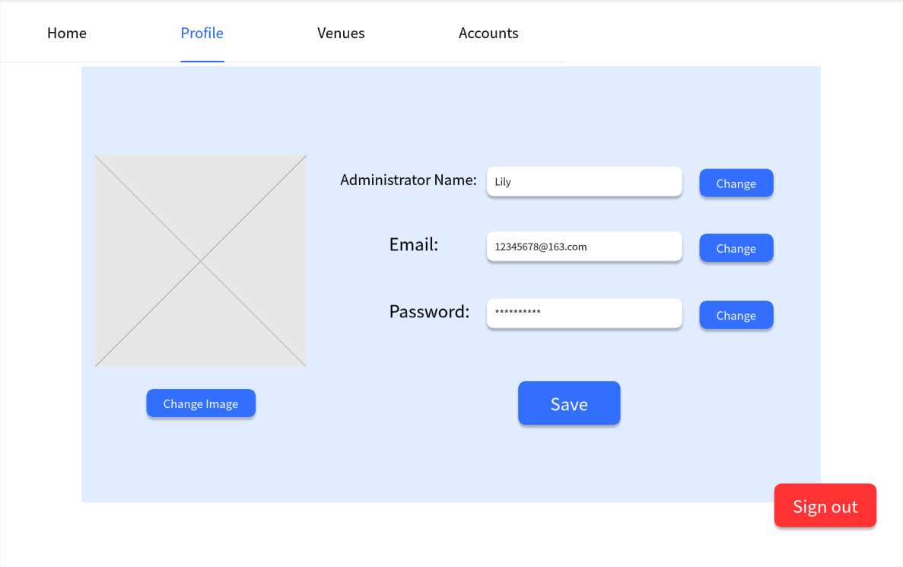
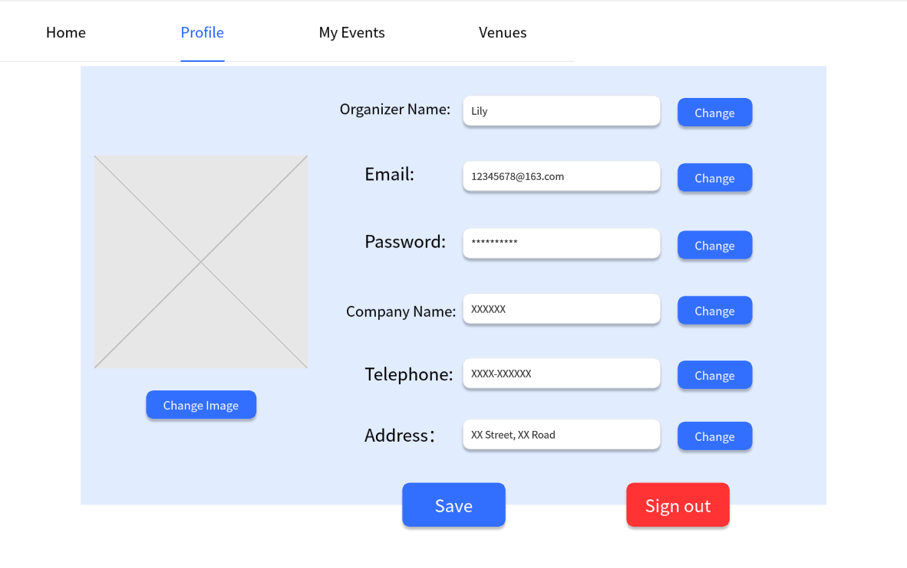
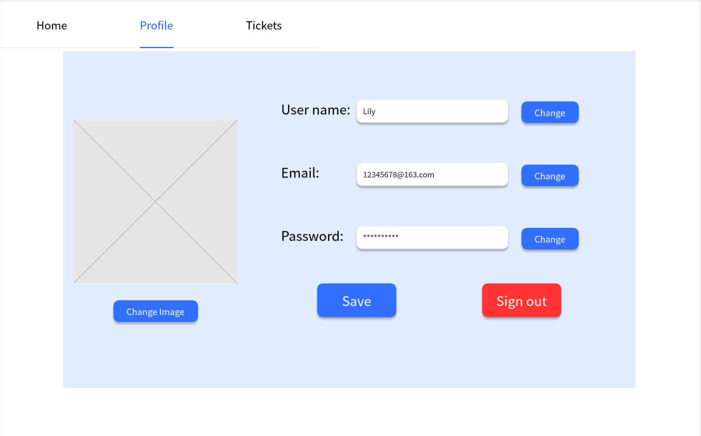

# Use Case 04 - Modify Account

## Description

Allows the administrator, organizer or user to change the details of an account in the system. 

## Actors

Administrator, User, Organiser

## Triggers

This use case is triggered when the details of an account need to be changed

## Preconditions

- The administrator is on the list accounts page (04-list-accounts)
- The administrator, organizer or user is on the view account page (01-main-admin, 02-main-organiser, 03-main-user)

## Postconditions

- The administrator is shown the view account page (06-view&modify-account-admin-user, 12-view&modify-account-admin-admin, 15-view&modify-account-admin-organiser) with the updated details of the account
- The administrator, organiser or user is shown the view account page (16-profile-admin, 21-profile-organiser, 08-profile-user) with the updated details of the account

## Courses of Events

### Basic Course of Events - Administrator Modifying Other Accounts

1. The administrator selects the "change" option for either username, email, or password on view account page (06-view-account)
2. The system displays the modify one of the account detail information which shows the detail as editable fields
3. The administrator enters the updated detail of the account and clicks save
4. The system displays the view account page (06-view&modify-account-admin-user, 12-view&modify-account-admin-admin, 15-view&modify-account-admin-organiser) with the updated detail of the account

### Basic Course of Events - Administrator, Organizer or User Modifying Their Own Account

1. The administrator, organizer or user selects the "change" option for either username, email, or password on view account page (06-view-account)
2. The system displays the modify one of the account detail information which shows the detail as editable fields
3. The administrator, organizer or user enters the updated detail of the account and clicks save
4. The system displays the view account page (16-profile-admin, 21-profile-organiser, 08-profile-user) with the updated detail of the account

### Alternate Course of Events - Invalid Input

1. The administrator, organizer or user selects the "change" option for either username, email, or password on view account page (06-view-account)
2. The system displays the modify one of the account detail information which shows the detail as editable fields
3. The administrator, organizer or user enters the updated detail of the account and clicks save
4. The system displays a warning message indicating that the input is invalid
5. The user selects OK and returns to step 2 (06-view-account) in the basic course of events

### Extension Points

None

## Inclusions

Account retrieval, change operations for email, username, and password.

## Relevant UI Sketches
| Page Name                           | Image                                                               |
|-------------------------------------|---------------------------------------------------------------------|
| List Accounts Page                  |                       |
| View Account Page (Admin-User)      |       |
| View Account Page (Admin-Admin)     |      |
| View Account Page (Admin-Organiser) |  |
| View Account Page (Admin)           |                        |
| View Account Page (Organiser)       |                    |
| View Account Page (User)            |       |

## Data Outcomes
**READ** - The details of the selected account will be read and displayed

**UPDATE** - The details of the selected account will be changed

