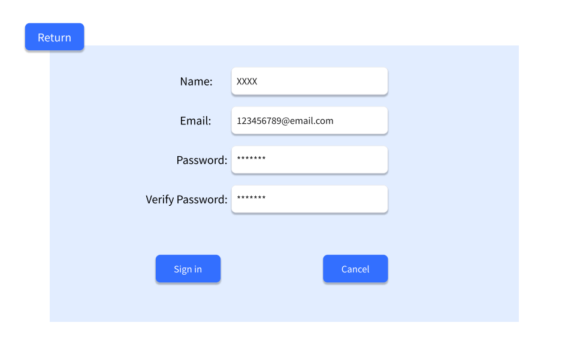
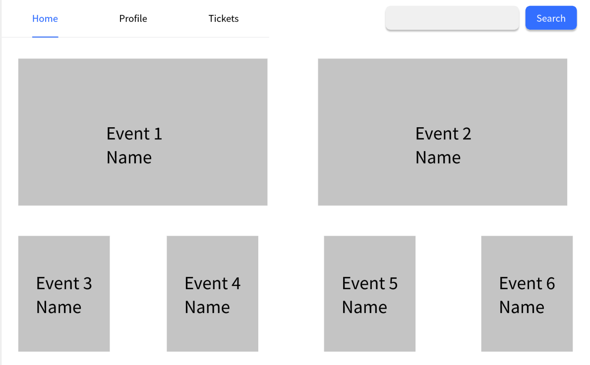

# Use Case 05 - Register Account

## Description

Allows the user to create a new account in the system

## Actors

User

## Triggers

This use case is triggered when a new user account is needed

## Preconditions

- The user is on the login page of the system (00-login)

## Postconditions

- The user is taken to the home page of the system (01-main-user)

## Courses of Events

### Basic Course of Events
1. The user selects the “Sign in as user” on login page (00-login)
2. The system displays the registration page of the system (02-sign-user)
3. The user enters the required details to create an account and clicks "Register"
4. The system displays the home page of the system (01-main-user)

### Alternative Courses of Events - Invalid Input

1. The user selects the create account functionality
2. The system displays an input form to get the required details (details required are based on the type of account being created) (02-sign-user)
3. The user enters the details of the account
4. The system displays an error message indicating that some inputs are invalid
5. The user clicks OK
6. The system returns to the create account page (02-sign-user)

### Alternative Courses of Events - Account Already Exists

1. The user enters the required details to create an account and clicks "Register"
2. The system displays an error message indicating that the account already exists
3. The user clicks OK
4. The system returns to the create account page (02-sign-user

### Extension Points

None

## Inclusions

Account register operations for user's email, username, and password.

## Relevant UI Sketches
| Page Name               | Image                                                                                   |
|-------------------------|-----------------------------------------------------------------------------------------|
| Login Page              |                                                           |
| Sign Page               |                                                    |  |
| Main User Page          |                                                   |
| Duplicate Email Message |  |

## Data Outcomes
**CREATE** - A new account will be created and added to the system

**READ** - The details of the newly created account will be read and displayed

