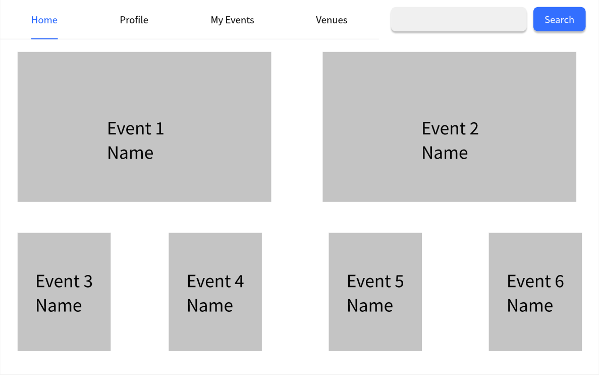
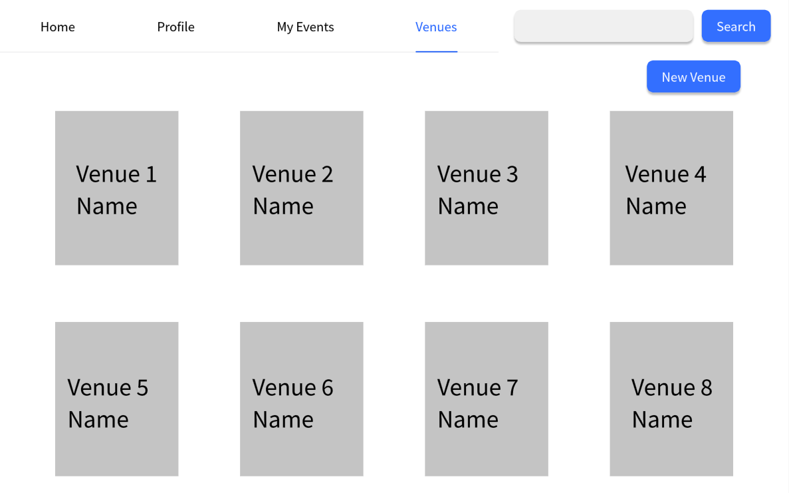

# Use Case 07 - Add Venue

## Description

Allows the organiser to add a new venue to the system

## Actors

Organizer

## Triggers

This use case is triggered when the organiser wants to create a new venue

## Preconditions

- The is on the organiser are on the list venues page (22-venues-organiser) or the home page (02-main-organiser) and the venue must not exist in the system

## Postconditions

- The user is shown the new venue on the list venues page (22-venues-organiser)

## Courses of Events

### Basic Course of Events

1. The organiser selects the add venue functionality
2. The system displays the add and modify venue page (24-modify-venue-organiser) page
3. The organiser enters the details of the venue
4. The system shows the new venue on the list venues page (22-venues-organiser)

### Alternate Course of Events - The Organiser Not Save

1. The organiser selects the add and modify venue functionality
2. The system displays the add and modify venue page (24-modify-venue-organiser) page
3. The organiser enters the details of the venue，but clicks Cancel
4. The system returns to the list venues page (22-venues-organiser)

### Extension Points

None

## Inclusions

None

## Relevant UI Sketches
| Page Name                       | Image |
|---------------------------------|------|
| Organiser Main Page             | |
| The List Venues Page(Organiser) |  
| The Add and Modify Venue Page   | |
## Data Outcomes
**READ** - The details of the all venues will be read and displayed

**CREATE** - The details of the new venue will be created

