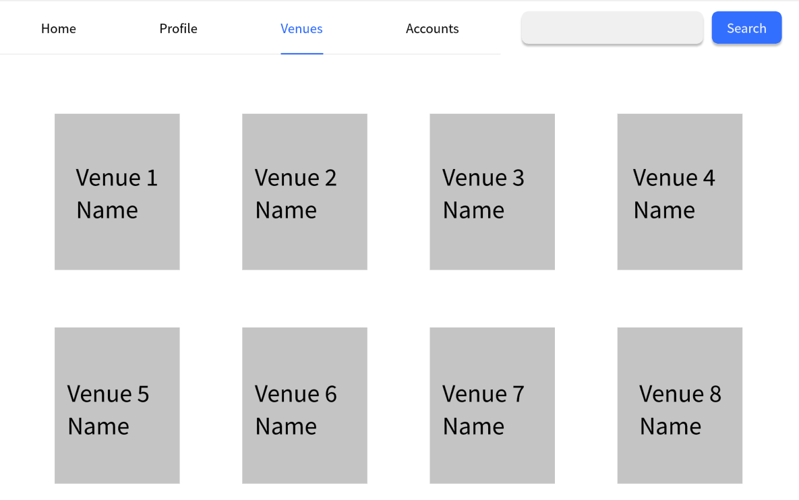
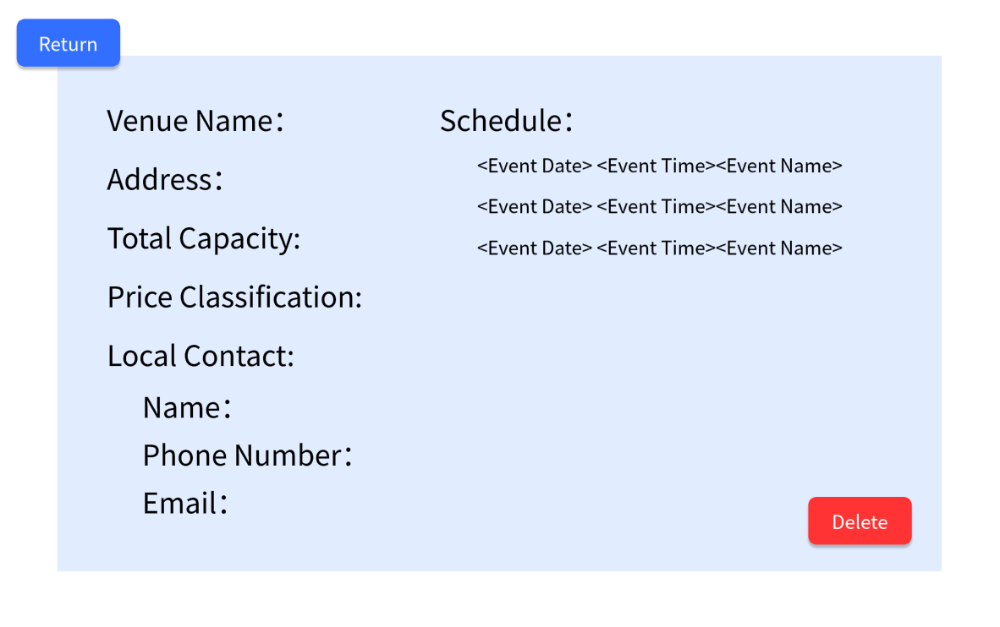

# Use Case 08 - View Venue

## Description

Allows the administrator or organiser view a venue in the system

## Actors

Administrator, Organizer

## Triggers

This use case is triggered when the administrator or organiser needs to view the details of a venue in the system

## Preconditions

- The is on the administrator or organiser are on the list venues page (17-list-venues-admin, 22-venues-organiser)

## Postconditions

- The details of the venue are shown on the view venue page (13-check-venue-admin, 23-check-venues-organiser)

## Courses of Events

### Basic Course of Events

1. The organiser or administrator selects the view venue functionality adjacent to the venue they want to view
2. The system displays the view venue page (13-check-venue-admin, 23-check-venues-organiser) with the details of the venue

### Extension Points

None

## Inclusions

None

## Relevant UI Sketches
| Page Name                    | Image                                                       |
|------------------------------|-------------------------------------------------------------|
| List Venues Page (Admin)     |     |
| List Venues Page (Organiser) |  |
| View Venue Page (Admin)      |      |
| View Venue Page (Organiser)  |  |

## Data Outcomes
**READ** - The details of the selected venue will be read and displayed

