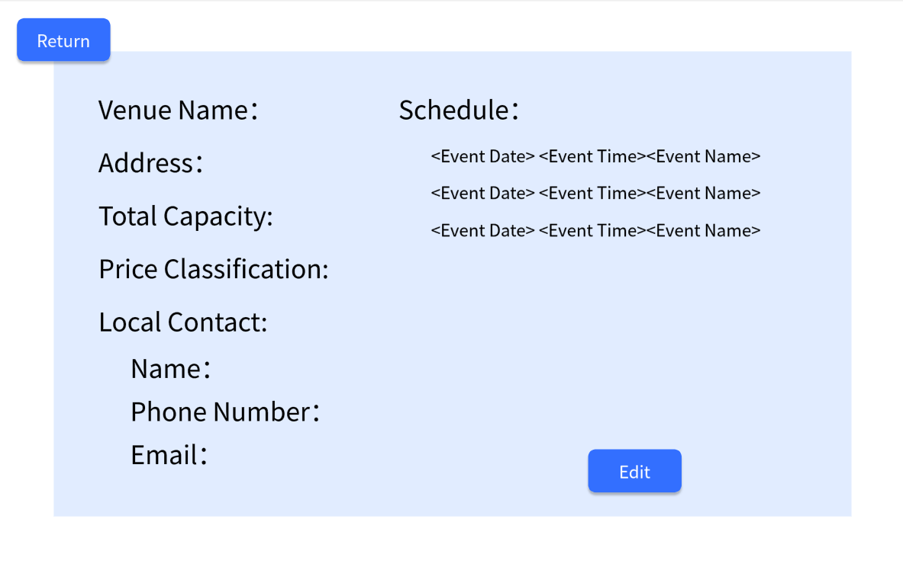
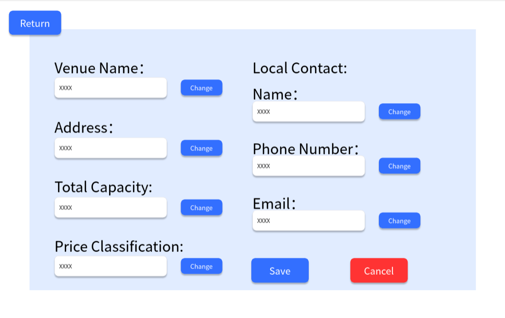

# Use Case 09 - Modify Venue

## Description

Allows organiser to modify the details of a venue in the system

## Actors

Organizer

## Triggers

This use case is triggered when the organiser needs to modify the details of a venue in the system

## Preconditions

- The is on the organiser are on the list venues page (22-venues-organiser) or the view venue page (23-check-venues-organiser )

## Postconditions

- The details of the venue are shown on the list venue page (22-venues-organiser)

## Courses of Events

### Basic Course of Events

1. The organiser selects the edit venue functionality adjacent to the venue they want to view on the list venues page or at the view venue page
2. The system displays the add and modify venue page (24-modify-venue-organiser) page
3. The organiser modifies the details of the venue
4. The system updates the details of the venue and return on the list venue page (22-venues-organiser)

### Alternate Course of Events - The Organiser Not Save

1. The organiser selects the add and modify venue functionality
2. The system displays the add and modify venue page (24-modify-venue-organiser) page
3. The organiser modifies the details of the venue，but clicks Cancel
4. The system returns to the list venues page (22-venues-organiser)

### Extension Points

None

## Inclusions

None

## Relevant UI Sketches
| Page Name                     | Image                                                                                                                     |
|-------------------------------|---------------------------------------------------------------------------------------------------------------------------|
| The List Venues Page(Organiser) |                                                                         |
| The View Venue Page(Organiser)            |                                                             |
| The Add and Modify Venue Page     |                                                             |

## Data Outcomes
**READ** - The details of the all venues will be read and displayed

**UPDATE** - The details of the venue will be updated
`
