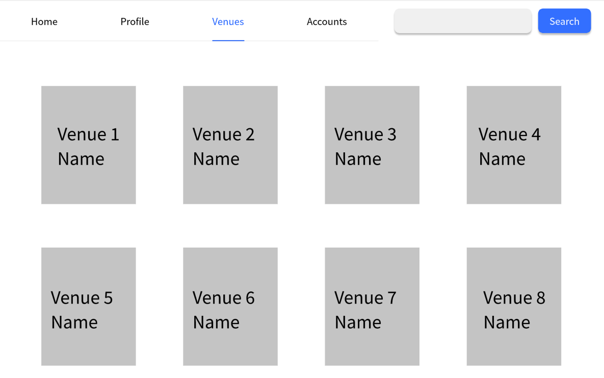

# Use Case 10 - Delete Venue

## Description

Allows the administrator to delete a venue from the system

## Actors

Administrator

## Triggers

This use case is triggered when the administrator needs to delete a venue from the system

## Preconditions

- The is on the administrator is on the list venues page (17-list-venues-admin) or the view venue page (13-check-venue-admin)

## Postconditions

- The system returns to the list venues page (17-list-venues-admin) and the venue is no longer displayed

## Courses of Events

### Basic Course of Events

1. The administrator selects the delete venue functionality adjacent to the venue they want to remove on the list venues page
2. The system asks the administrator to confirm the deletion of the venue (30-delete-venue-warning)
3. The administrator clicks OK
4. The system returns to the list venues page (17-list-venues-admin) and the venue is no longer displayed

### Alternate Course of Events - Not Confirmed

1. The administrator selects the delete venue functionality adjacent to the venue they want to remove on the list venues page
2. The system asks the administrator to confirm the deletion of the venue (30-delete-venue-warning)
3. The administrator clicks Cancel
4. The system returns to the list venues page (17-list-venues-admin) with no changes
### Extension Points

None

## Inclusions

None

## Relevant UI Sketches
| Page Name | Image                                                    |
|----|----------------------------------------------------------|
| List Venues Page (Admin) |  |
| Delete Venue Warning |   |

## Data Outcomes
**READ** - The details of the all venues will be read and displayed

**DELETE** - The details of the venue will be removed from the system

