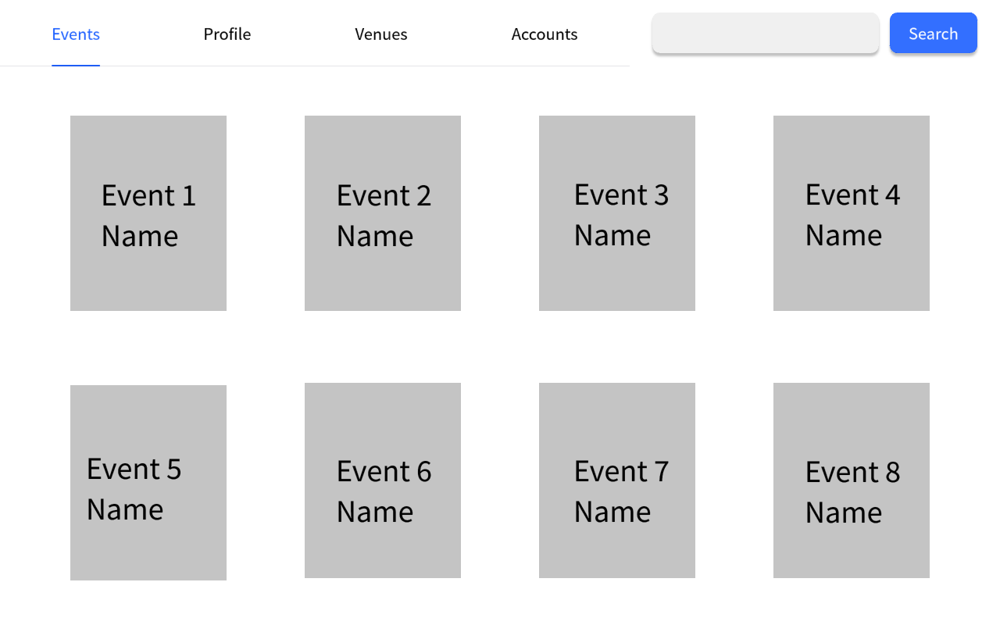

# Use Case 11 - List Events

## Description

Allows the administrator or the organiser or the user to view all upcoming events

## Actors

Administrator, Organizer, User

## Triggers

This use case is triggered when the administrator or the organiser or the user needs to view all upcoming events in the system

## Preconditions

- The administrator or the organiser or the user is on any page

## Postconditions

- The administrator is shown the main page (01-main-admin) which shows all upcoming events
- The organiser is shown the main page (02-main-organiser) which shows all upcoming events
- The user is shown the main page (03-main-user) which shows all upcoming events

## Courses of Events

### Basic Course of Events - The Administrator Viewing All Upcoming Events

1. The administrator selects the list events functionality
2. The system displays the all events page (01-main-admin) which shows all upcoming events

### Basic Course of Events - The Organiser Viewing All Upcoming Events

1. The organiser selects the list events functionality
2. The system displays the all events page (02-main-organiser) which shows all upcoming events

### Basic Course of Events - The User Viewing All Upcoming Events

1. The user selects the list events functionality
2. The system displays the all events page (03-main-user) which shows all upcoming events

### Extension Points

None

## Inclusions

None

## Relevant UI Sketches
| Page Name           | Image                                                     |
|---------------------|-----------------------------------------------------------|
| Admin-Main-Page     |  |
| Organiser-Main-Page |            |
| User-Main-Page      |                       |

## Data Outcomes
**READ** - The details of the selected account will be read and displayed

