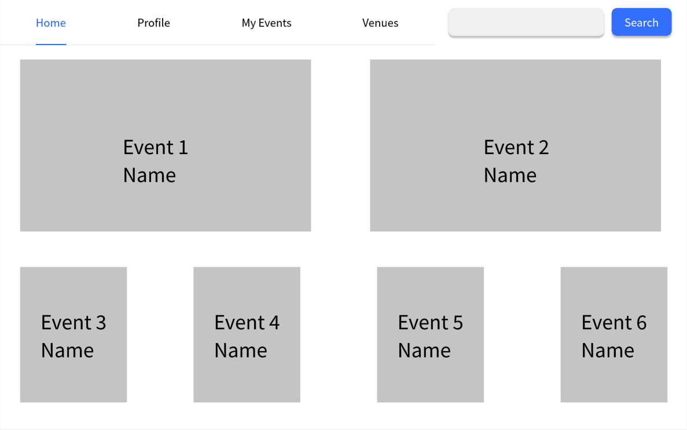

# Use Case 12 - Add Event

## Description

Allows the organiser to add a new event to the system

## Actors

Organizer

## Triggers

This use case is triggered when the organiser wants to create a new event

## Preconditions

- The is on the organiser are on the list events page (20-events-organiser) or the home page (02-main-organiser) and the event must not exist in the system

## Postconditions

- The user is shown the new event on the list events page (20-events-organiser)

## Courses of Events

### Basic Course of Events

1. The organiser selects the add event functionality
2. The system displays the add event and modify page (19-modify-event-organiser) page
3. The organiser enters the details of the event
4. The system shows the new event on the list events page (20-events-organiser)

### Alternate Course of Events - The Organiser Not Save

1. The organiser selects the add event functionality
2. The system displays the add and modify event page (19-modify-event-organiser) page
3. The organiser enters the details of the event，but clicks Cancel
4. The system returns to the list events page (20-events-organiser)

### Extension Points

None

## Inclusions

None

## Relevant UI Sketches
| Page Name                     | Image                                            |
|-------------------------------|--------------------------------------------------|
| Organiser-Main-Page           |    |
| The Add and Modify Event Page |                   |
| The List Events Page(Organiser) |  |

## Data Outcomes
**READ** - The details of the all events will be read and displayed

**CREATE** - The details of the event will be modified.
