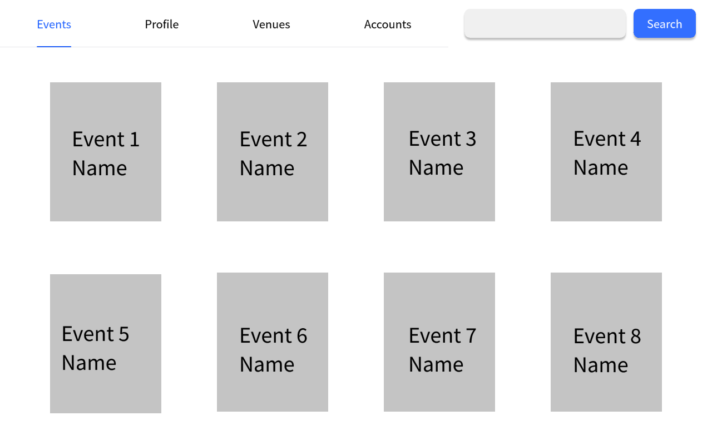
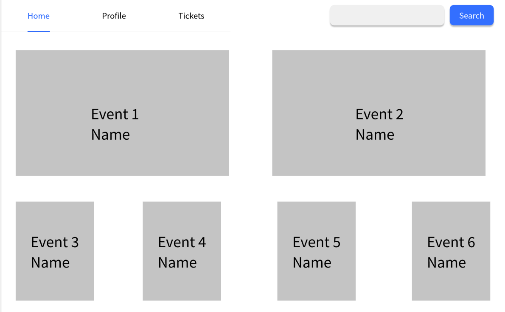
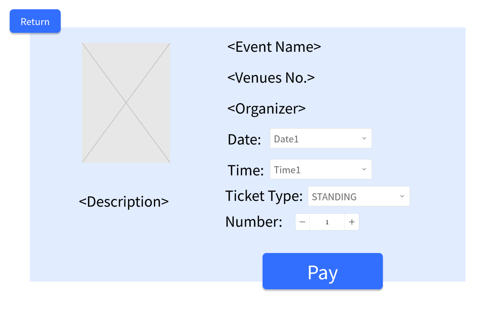

# Use Case 13 - View Event

## Description

Allows the administrator or the organiser or the user to view an upcoming event details

## Actors

Administrator, Organizer, User

## Triggers

This use case is triggered when the administrator or the organiser or the user needs to view an upcoming event details in the system

## Preconditions

- The administrator or the organiser or the user is on the main page (01-main-admin, 02-main-organiser, 03-main-user)

## Postconditions

- The details of the event are shown on the view event page (10-buy-tickets)

## Courses of Events

### Basic Course of Events

1. The administrator or the organiser or the user selects the view event functionality adjacent to the event they want to view
2. The system displays the view event page (10-buy-tickets) with the details of the event

### Extension Points

None

## Inclusions

None

## Relevant UI Sketches
| Page Name           | Image                                                     |
|---------------------|-----------------------------------------------------------|
| Admin Main Page     |  |
| Organiser Main Page |            |
| User Main Page      |                       |
| View Event Page    |  |

## Data Outcomes
**READ** - The details of the selected event will be read and displayed

