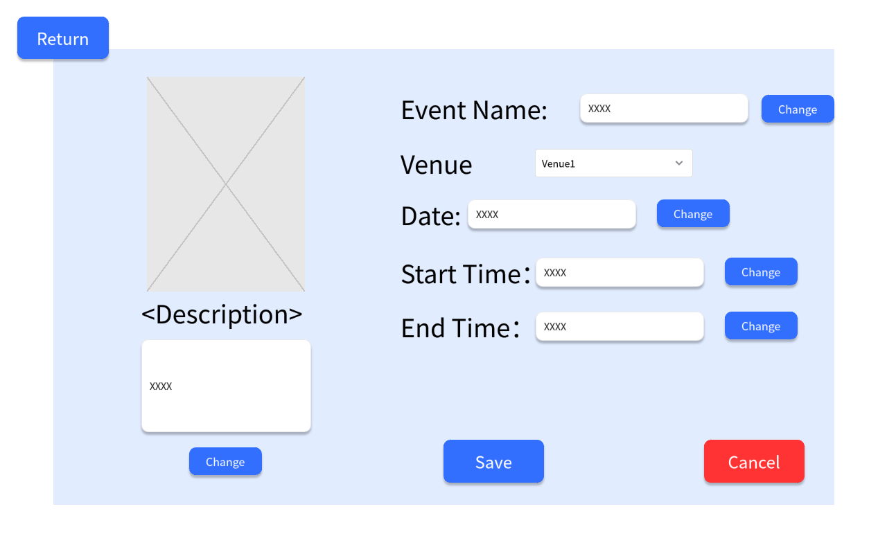
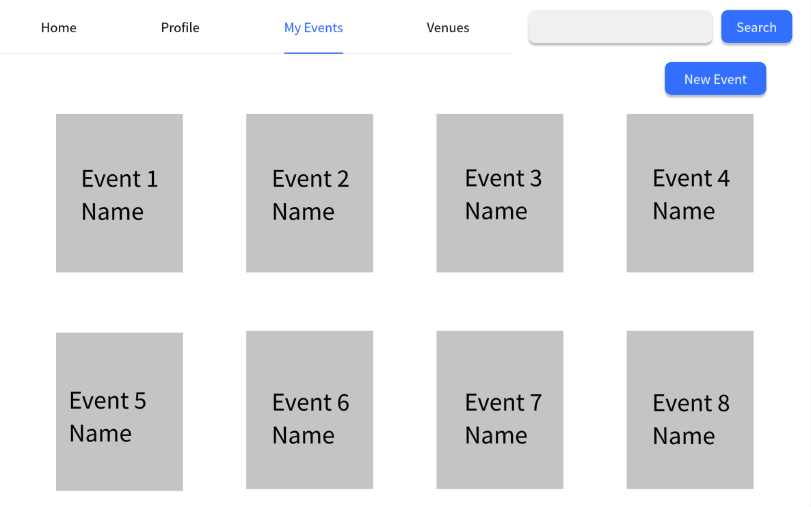

# Use Case 14 - Modify Event

## Description

Allows organiser to modify the details of the event in the system

## Actors

Organizer

## Triggers

This use case is triggered when the organiser needs to modify the details of the event in the system

## Preconditions

- The is on the organiser are on the list events page (20-events-organiser) or the add and modify event page (19-modify-event-organiser)

## Postconditions

- The details of the event are shown on the add and modify event page (19-modify-event-organiser)

## Courses of Events

### Basic Course of Events

1. The organiser selects the edit event functionality to the event they want to view on the list events page or at the modify event page
2. The system displays the add and modify event page (19-modify-event-organiser) page
3. The organiser modifies the details of the event
4. The system updates the details of the event and return to the list events page (20-events-organiser)

### Alternate Course of Events - The Organiser Not Save

1. The organiser selects the modify event functionality to the event they want to view on the list events page or at the modify event page
2. The system displays the add and modify event page (19-modify-event-organiser) page
3. The organiser  modifies the details of the venue，but clicks Cancel
4. The system returns to the list events page (20-events-organiser)

### Extension Points

None

## Inclusions

None

## Relevant UI Sketches
| Page Name | Image                                                                                                |
|----|------------------------------------------------------------------------------------------------------|
|The Add and Modify Event Page|                                        |
|The List Events Page(Organiser)  |                                                    |

## Data Outcomes
**READ** - The details of the all events will be read and displayed

**UPDATE** - The details of the event will be updated
