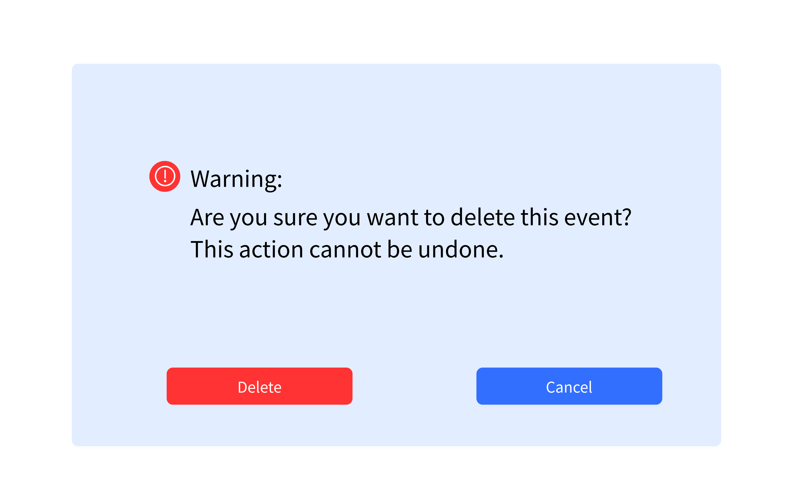

# Use Case 15 - Delete Event

## Description

Allows the administrator to delete an event from the system

## Actors

Administrator

## Triggers

This use case is triggered when the administrator needs to delete an event from the system

## Preconditions

- The is on the administrator is on the main page (01-main-admin) or the view event page (14-check-event-admin)

## Postconditions

- The system returns to the main page (01-main-admin) and the event is no longer displayed

## Courses of Events

### Basic Course of Events

1. The administrator selects the delete event functionality adjacent to the event they want to remove on the main page
2. The system asks the administrator to confirm the deletion of the event (31-delete-event-warning)
3. The administrator clicks OK
4. The system returns to the main page (01-main-admin) and the event is no longer displayed

### Alternate Course of Events - Not Confirmed

1. The administrator selects the delete event functionality adjacent to the event they want to remove on the main page
2. The system asks the administrator to confirm the deletion of the event (31-delete-event-warning)
3. The administrator clicks Cancel
4. The system returns to the main page (01-main-admin) with no changes
### Extension Points

None

## Inclusions

None

## Relevant UI Sketches
| Page Name        | Image                                                   |
|------------------|---------------------------------------------------------|
| Admin Main Page  |                 |
| Delete Event Warning |  |

## Data Outcomes
**READ** - The details of the all events will be read and displayed

**DELETE** - The details of the event will be removed from the system

