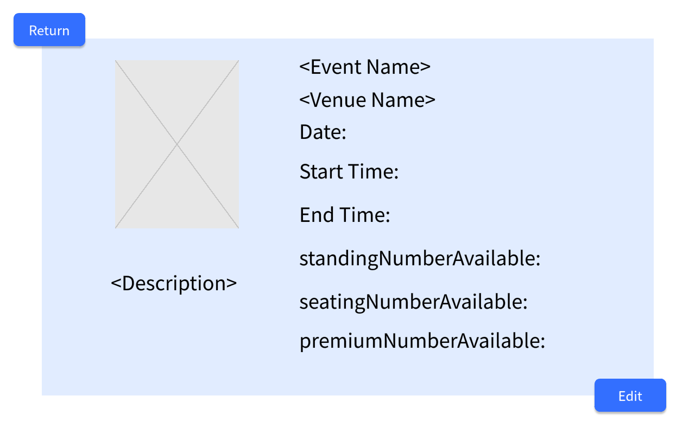

# Use Case 16 - List My Events

## Description

Allows the organiser to view their own events and the details of the event in the system

## Actors

Organizer

## Triggers

This use case is triggered when the organiser needs to view their own events and the details of events in the system in the system

## Preconditions

- The organiser is on any page

## Postconditions

- The user is shown the view event page (20-events-organiser) which shows the details of the selected event

## Courses of Events

### Basic Course of Events - The Organiser Viewing All Events

1. The organiser selects the list my events functionality
2. The system displays the all events page (20-events-organiser) which shows all organiser's venues in the system

### Basic Course of Events - The Organiser Viewing the Details of an Event

1. The organiser selects the view event functionality to an event's detail to view
2. The system displays the view event page (18-check-event-organiser) which shows the details of the selected event

### Extension Points

None

## Inclusions

None

## Relevant UI Sketches
| Page Name                       | Image                                                 |
|---------------------------------|-------------------------------------------------------|
| The View Event Page(Organiser)  |  |
| The List Events Page(Organiser) |     |

## Data Outcomes
**READ** - The details of the organiser's event will be read and displayed

