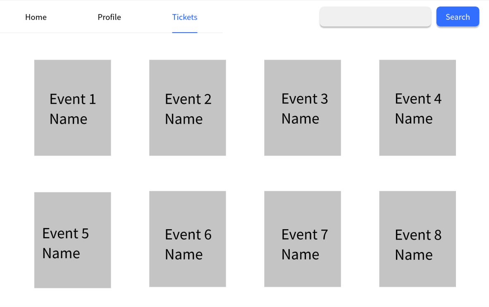
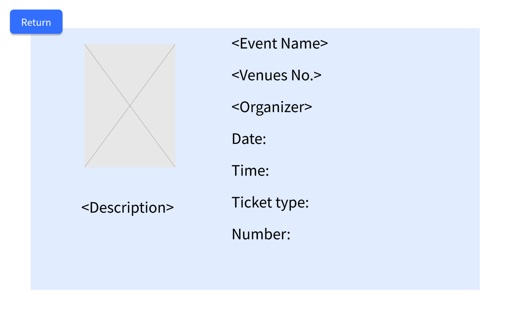

### Use Case 19 - View Tickets

## Description

The user can view all associated details of a specific ticketed activity that they seleted

## Actors

User

## Triggers

The user wants to review the details of one of their past or upcoming event purchase.

## Preconditions

- The user must on the home-tickets page (09-tickets-user).

## Postconditions

- None

## Courses of Events

### Basic Course of Events

1. The user selects an event to view its details on the home-tickets page (09-tickets-user).
2. The system displays detailed information for the selected event.

### Alternative Courses of Events

- None

### Extension Points

- None

## Relevant UI Sketches
| Page Name           | Image                                      |
|---------------------|--------------------------------------------|
| Tickets User Page   |  |
| Ticket Details Page |  |

## Inclusions
Event listing and detail view.

## Data Outcomes
**READ** - Event details for past and upcoming events that the user has purchased.
