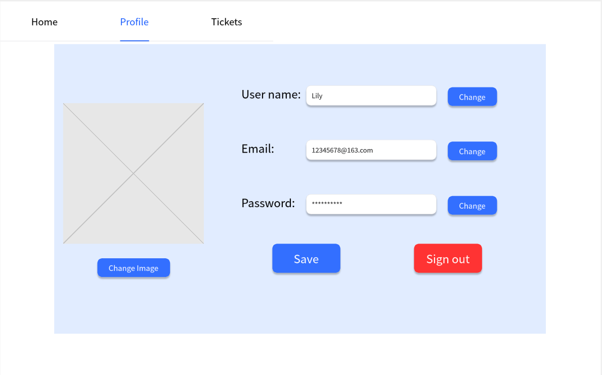
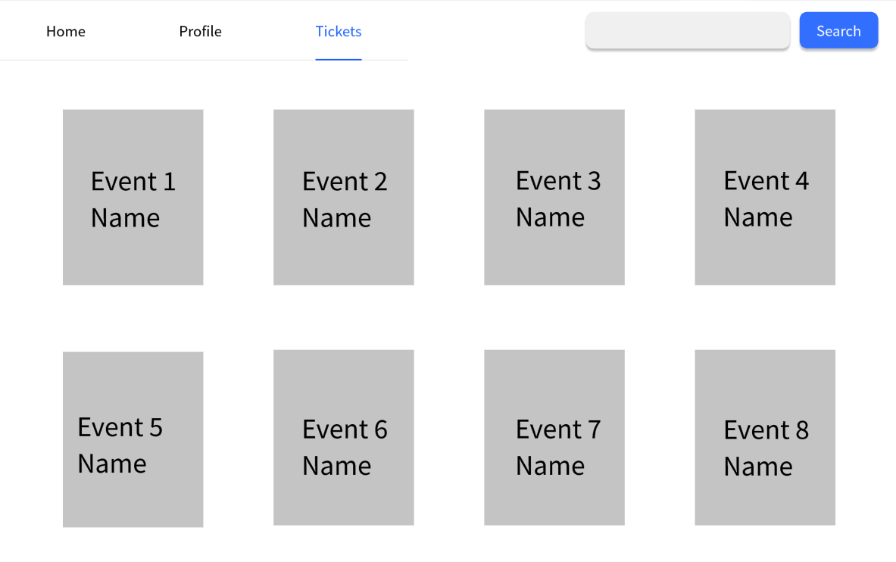
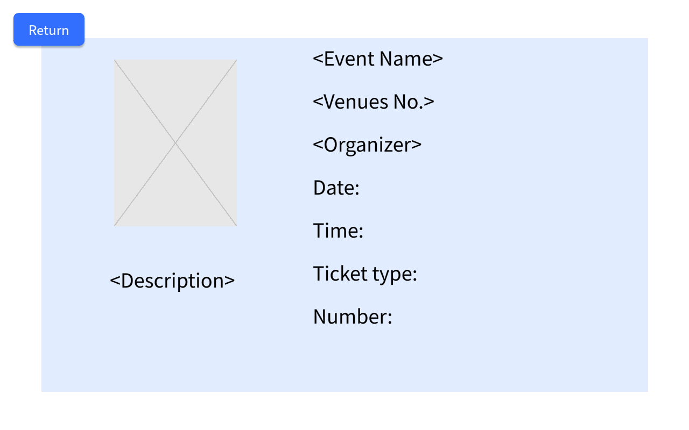
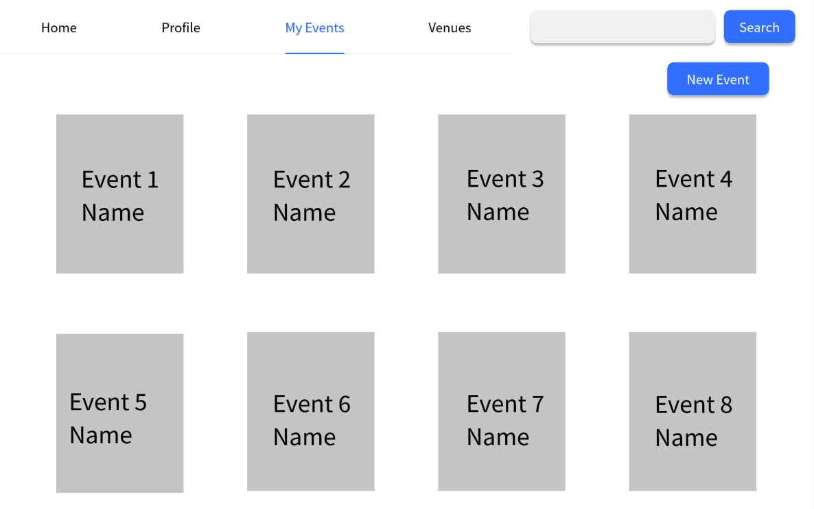
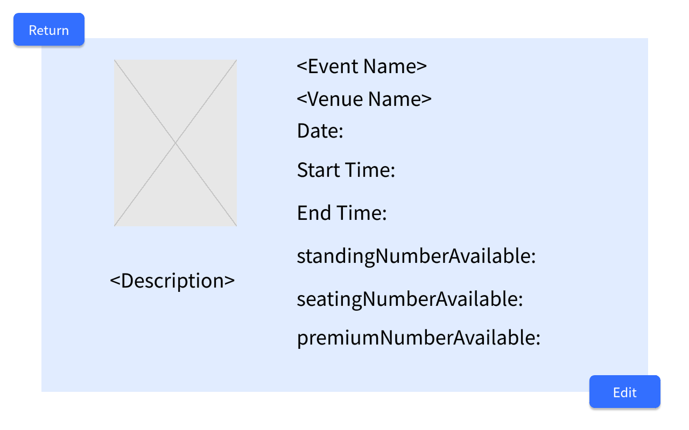
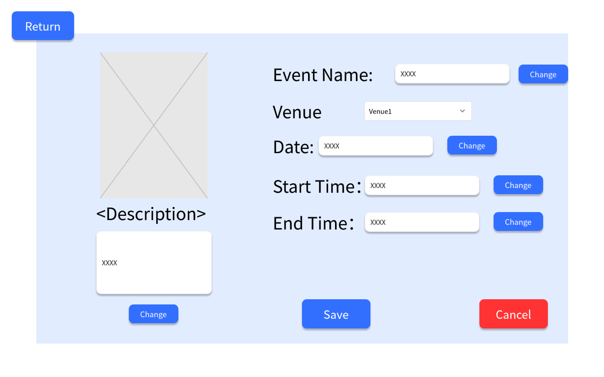
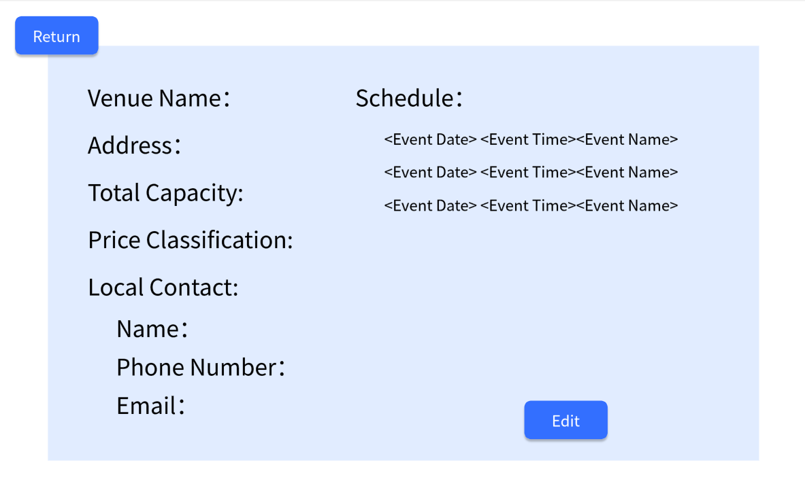
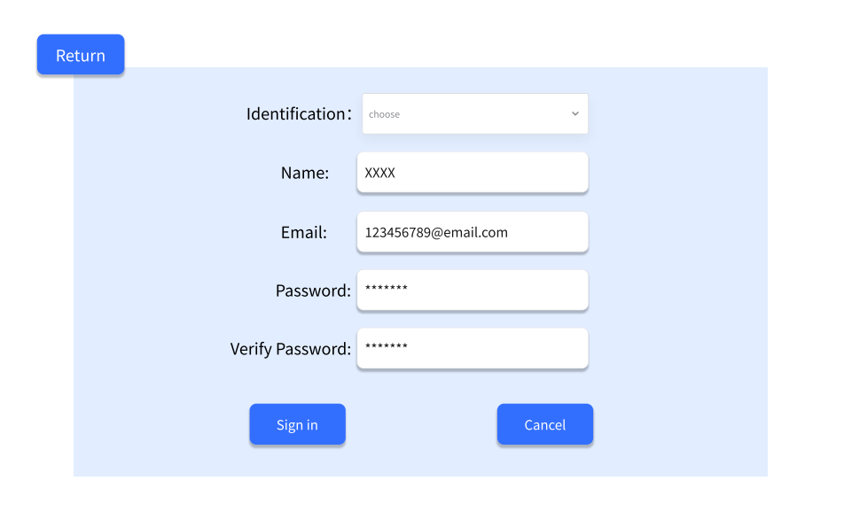
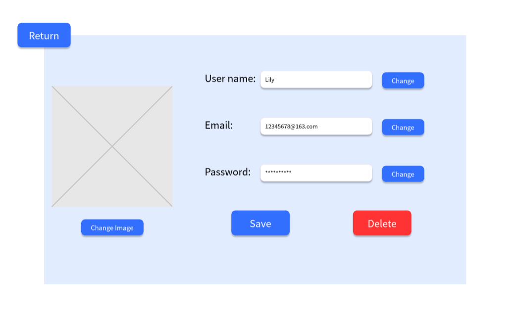

### Message From Sean

I have now checked out the contents of the repository for grading. Any further details added after the deadline will be ignored.

# Team Project: *Group 1*

## Team Members
| Number | Name          | Email(s)                  | CSGitLab Username |
|--------|---------------|---------------------------|-------------------|
| TM1    | Qiyue Zhu     | qiyue.zhu@ucdconnect.ie   | @Victoria         |
| TM2    | Wenyi Liang   | wenyi.liang@ucdconnect.ie | @Wenyi            |     
| TM3    | Yunfei Xu     | yunfei.xu@ucdconnect.ie   | @Kira210          |     
| TM4    | Zitong Wang   | zitong.wang@ucdconnect.ie | @sukikatte        |     
| TM5    | Siqi Du       | siqi.du@ucdconnect.ie     | @Yuki             |     
| TM6    | Jiayi Cai     | jiayi.cai@ucdconnect.ie   | @22207285         |     
| TM7    | Yani Yang     | yani.yang@ucdconnect.ie   | @hs               |     
| TM8    | Boran Duan    | boran.duan@ucdconnect.ie  | @boran            |

# Requirements Analysis
---

## Project Overview
- **Project Name**: Web-Based Event and Ticket Management System
- **Project Description**: This project aims to design and implement a web application built on the Spring Boot framework, focused on managing events, venues, and tickets. The system’s users include administrators, organizers, and regular users, each with different functional permissions.
- **Development Platform**: Spring Boot Web Application

---

## System Objectives
- The system aims to provide efficient and user-friendly solutions for event and ticket management by incorporating functionalities for account management, venue management, event management, and ticket management. Three main user roles (Administrator, Organizer, and User) will utilize the system to perform relevant management and ticket purchasing functions, enhancing event organization and user experience.

---

## Core Functional Requirements

### 1. Account Management
- **User Roles**: The system should support three user roles: Administrators, Organizers, and Users which are created by the account. The permissions and functions of each role are as follows:
    - **Administrator**:
        - Can register administrator and organizer new accounts.
        - Can view and edit details of all accounts (including administrator, organizer, and user accounts).
        - The recorded account information includes: name, email, and password.
    - **Organizer**:
      - Can view and edit their account information.
      - The recorded account information includes: name, address, company name, email, password, phone number, and a list of organized events.
    - **User**:
        - Can register a new account, view and update their account information
        - The recorded account information includes: username, email, password, and a list of purchased events.

### 2. Venue Management
- **Venue Management Permissions**:
    - **Organizer**: Can view and edit all venues and their details in the system, as well as add new venues.
    - **Administrator**: Can view all venues and their details in the system, and delete venues.
- **Venue Information**: Each venue should include the following details:
    - Venue name, address, local contact information (name, phone number, email).
    - Total capacity and a breakdown of ticket types available (e.g., standing, seating, premium), with quantities for each ticket type.

### 3. Event Management
- **Event Management Permissions**:
    - **Organizer**:  Can view and edit the events they have created and their details, as well as create new events.
    - **Administrator**: Can view all events and their details, and delete events.
    - **User**: Can view all upcoming events and their details.
- **Event Information**: Each event includes:
    - Event name, description, date, time, venue, organizer, and ticket details.
    - **Ticket Details**: Price, quantity available, and quantity sold for each ticket type.
    - **Restrictions**: The system must ensure that no duplicate events occur at the same venue and time.

### 4. Ticket Management
- **Ticket Purchase Permissions**:
    - **User**: 
        - Once logged in, users can view a list of upcoming events, view event details, and choose to purchase tickets. 
        - Users can view their ticket purchase history, including past events and upcoming events.
- **Ticket Information**: After purchasing, ticket details are stored in the user’s account. Information includes:
    - Event details, venue details, seat type, and ticket price.
- **Payment Processing**: It is assumed that payment processing is handled by an external system, and is not within the scope of this project.

---

## Non-Functional Requirements

- **Performance Requirements**: The system should support at least 5,000 concurrent users.
- **Security Requirements**: The account management module should ensure encrypted passwords and secure handling of sensitive information.
- **Compatibility Requirements**: The system should be compatible with commonly used modern browsers (e.g., Chrome, Firefox, Safari).
- **Usability Requirements**: The user interface should be intuitive, clear, and easy to navigate for both users and organizers.

---

## System Boundaries

### 1. System Scope
- **Included Features**:
    - **Account Management**: The system supports registration, login, and information management for administrators, organizers, and regular users. Administrators manage all user accounts, while organizers and users can only manage their own account information.
    - **Venue Management**: The system supports organizers in adding, viewing, and editing venue information. Administrators can delete venues.
    - **Event Management**: Organizers can create, manage, and view event details. Administrators can delete events.
    - **Ticket Management**: The system allows users to view event information, purchase tickets, and review purchase history. Ticket management includes viewing ticket types, prices, and seat information.
- **Excluded Features**:
    - **Payment Processing**: The system does not handle the ticket payment process or payment security. It is assumed that payment processing is completed by a third-party payment system, and the system only records ticket transaction status without handling payment transactions or financial records.
    - **External Data Integration**: The system does not integrate with external data sources (such as other ticketing systems or venue management systems).
    - **Advanced Analytics**: Features like ticket sales data analysis and marketing data analysis are outside the scope of this system.
    - **Diverse venue shapes**: Venue shapes are restricted to rectangular forms.
    - **Automatic seat assignment**: Users cannot manually select seats; the system assigns them automatically.

### 2. Assumptions
- The system relies on a reliable third-party payment system to ensure users can complete ticket transactions.
- System users (including administrators, organizers, and regular users) can access the system through modern browsers (e.g., Chrome, Firefox, Safari) without reliance on specific operating systems.
- It is assumed that input data (such as user information and venue information) is accurately provided by users or administrators. The system will provide basic validation, but not enforce extensive data validation.

### 3. System Limitations
- Concurrent access capability for 5000 users: This is a system limitation, defining the system's maximum concurrent user capacity.
- No data backup and recovery functionality: The system does not provide backup capabilities, which is a technical limitation.
- Supports only common ticket types: The system is limited to supporting specific ticket types, which is a functional limitation.
- Venue shape limitation: All venues are rectangular and do not support shape diversity, which is a design limitation of the system.
- Automatic seat assignment: Users cannot select seats manually; the system automatically assigns them. This is a usage limitation of the system.

---

## Role Analysis (Actors)

The system has three main roles:

- **Administrator**:  Manages all accounts and can delete venues and event information, ensuring the system operates smoothly.
- **Organizer**: Manages events and venue information, responsible for publishing and maintaining event-related information.
- **User**: Manages the events they create and all venue information, responsible for publishing events and maintaining related information.
---

## Use Case Descriptions

This includes the following use cases:

1. [Create Account](01-create-account.md)
2. [List Accounts](02-list-accounts.md)
3. [View Account](03-view-account.md)
4. [Modify Account](04-modify-account.md)
5. [Register Account](05-register-account.md)
6. [List Venues](06-list-venues.md)
7. [Add Venue](07-add-venue.md)
8. [View Venue](08-view-venue.md)
9. [Modify Venue](09-modify-venue.md)
10. [Delete Venue](10-delete-venue.md)
11. [List Events](11-list-events.md)
12. [Add Event](12-add-event.md)
13. [View Event](13-view-event.md)
14. [Modify Event](14-modify-event.md)
15. [Delete Event](15-delete-event.md)
16. [List My Events](16-list-my-events.md)
17. [List Tickets](17-list-tickets.md)
18. [Buy Ticket](18-buy-ticket.md)
19. [View Ticket](19-view-ticket.md)

## Use Case Diagram

The use cases are shown in this diagram

## Domain Model

## System Glossary

| Term                 | Description                                                                                                             |
|----------------------|-------------------------------------------------------------------------------------------------------------------------|
| Identification       | Confirmation of the current account type, including Administrator, Organizer, and User                                  |
| Administrator        | Manages user accounts and has permission to delete events and venues, but cannot create events and venues               |
| Organizer            | Responsible for creating and updating events and venues, but does not have permission to delete them                    |
| User                 | A regular user who can purchase tickets, view and participate in events, and check purchase history                     |
| Accounts             | Contains three types of accounts, each with key information that depends on the account type                            |
| Name                 | The nickname given by the account user, which can be changed by the user                                                |
| Email                | Necessary information when creating a new account, used to contact the user                                             |
| Password             | Necessary information when creating a new account, used for identity verification during login                          |
| Telephone            | The organizer's phone number, necessary information when creating a new organizer account                               |
| Home                 | The page that displays all upcoming events                                                                              |
| Profile              | Contains personal information in detail, allowing the user to change their nickname and contact information, etc.       |
| Tickets              | The ticket page allows users to view their own ticket purchase history                                                  |
| Search               | Enables the administrator to retrieve and review all existing accounts using either the user name or the email address  |
| My Events            | Organizers can view all the events for which they have permissions                                                      |
| Event                | Refers to a specific event, managed by organizers                                                                       |
| Description          | A detailed description of the event, including main casts and a content introduction, etc.                              |
| Date                 | The date of the event, which may include multiple dates of the same event                                               |
| Time                 | Specific time information about one event, including the start time and end time (duration)                             |
| Venues               | The name of the venue, which can be changed by organizers and administrators                                            |
| Venue No.            | A unique encoded number for the venue                                                                                   |
| Address              | The physical address of the venue                                                                                       |
| Schedule             | The venue's schedule, which includes all upcoming events held at the venue                                              |
| Local contact        | Venue contact information, including the responsible person's details (name, phone, and email)                          |
| Total capacity       | The total capacity of the venue, which depends on the venue itself                                                      |
| Total number         | The total number of tickets available, related to the capacity of the event                                             |
| Sold number          | The number of tickets that have already been sold (0 to total)                                                          |
| Ticket Type          | Types of event tickets                                                                                                  |
| Standing Ticket      | A standing ticket, with no seat provided, requiring standing to watch                                                   |
| Seating Ticket       | A seating ticket, where each ticket corresponds to a unique seat assigned by the system                                 |
| Premium Ticket       | A front-row ticket, a high-priced ticket that offers additional services or special treatment                           |
| Price classification | Displays the price classification, including all ticket prices related to ticket types                                  |
| Price                | The selling price of a particular type of ticket for a specific event                                                   |
| Company              | Refers to the company hosting the events, managed by the corresponding organizer                                        |
| Pay                  | The action of paying for the order; in this project, only a button is provided, without specific implementation actions |

## UI Prototypes/Sketches
The following is the UI prototype for the event management application.

### 1 Login Page

### 2 User
#### 2.1 Sign in Page

#### 2.2 Home Page

#### 2.3 Profile Page

#### 2.4 Tickets Pages
##### 2.4.1 Holder Page

##### 2.4.2 Detail Page

##### 2.4.3 Payment Page

### 3 Organizer
#### 3.1 Home Page

#### 3.2 Profile Page

#### 3.3 Events Pages
##### 3.3.1 Management Page

##### 3.3.2 Detail Page

##### 3.3.3 Create and Edit Page

#### 3.4 Venue Pages
##### 3.4.1 Management Page

##### 3.4.2 Detail Page

##### 3.4.3 Create and Edit Page

### 4 Administrator
#### 4.1 Home Page

#### 4.2 Profile Page

#### 4.3 Venue Pages
##### 4.3.1 Management Page

##### 4.3.2 Detail Page

#### 4.4 Account Pages
##### 4.4.1 Search Page

##### 4.4.2 Create Page

##### 4.4.3 Edit User Page

##### 4.4.4 Edit Organizer Page

##### 4.4.5 Edit Administrator Page

## Milestone 1 Requirements Analysis

### Distribution of work on this milestone
#### Overall Distribution of Work
| Team Member | @Victoria | @Wenyi | @Kira210 | @sukikatte | @Yuki | @22207285 | @hs | @boran |
|-------------|-----|-----|-----|-----|-----|-----|-----|-----|
| Percentage  | 12% | 12% | 12% | 12% | 12% | 12% | 12% | 12% |
#### Task Allocation
| Item                 | Contributor 1            | Contributor 2| Contributor 3| Reviewer             |
|----------------------|--------------------------|-------------|-------------|----------------------|
| Requirement Analysis | @Yuki                    |             |             | @Victoria, @hs       |
| Use Case Diagram     | @Kira210                 |             |             | @boran, @Wenyi, @Victoria, @hs       |
| Domain Model         | @Victoria                |             |             | @boran, @hs          |
| System Glossary      | @sukikatte(90%)          | @hs(10%)    |             | @Victoria, @Wenyi    |
| UI Prototypes        | @hs(80%)                 | Other Members(20%) |      | @Victoria, @22207285 |
| Use Case 1: Administrator| @22207285            |             |             | @Victoria, @Yuki, @hs     |
| Use Case 2: Organizer| @boran                   |             |             | @Victoria, @Wenyi, @hs                     |
| Use Case 3: User     | @Wenyi                   |             |             | @Victoria, @boran, @hs                   |
           

#### Reflection Statements
| Team Member | Contribution Reflection Statement                                                                                                                                                                                                                                                                                                                                               |
|-------------|---------------------------------------------------------------------------------------------------------------------------------------------------------------------------------------------------------------------------------------------------------------------------------------------------------------------------------------------------------------------------------|
| @Victoria   | Mainly responsible for filling in member information, creating domain model diagram until the 5th final version, reviewing the work of other members and providing suggestions, leading the overall project planning, drafting and task allocation, and following up on the team's progress.  The members are caring, cooperative and always dare to raise opinions and questions:)    |
| @hs         | Completed all UI Prototypes/Sketches sections; collaborated with other members on System Glossary section;                                                                                                                                                                                                                                                                      |
| @Wenyi      | Completed all things in user use case. Helped to devise events terms (only the user) for Use Case Diagram. Reviewing the work of other members and providing suggestions,as well as follows up on team progress.                                                                                                                                                                |
| @Boran      | Completed all tasks in the organizer use cases and working on designing event terminology for the use case diagram and domain model (only for the organizer). Reviewing the work of other members, providing suggestions, and following up on team progress.                                                                                                                    |
| @Yuki       | Primarily responsible for researching and analyzing assignment documents and converting them into requirement analysis reports (system objectives, core functions, system boundaries, etc.). Reviews the sections handled by other members and provides suggestions, as well as follows up on team progress.                                                                    |
| @22207285   | Completed all tasks in the administrator use cases. Helped to improve the UI Prototypes (only for the administrator). Reviewing the work of other members, providing suggestions, and following up on team progress.                                                                                                                                                            |
| @Kira210    | completed all tasks in the use case diagram drawing and modification work. Reviewing the work of other members, providing suggestions, and following up on team progress.                                                                                                                                                                                                       |
| @Sukikatte  | Responsible for compiling and refining the System Glossary, ensuring that all terminology used throughout the project was clearly defined and accessible to all team members. Reviewing sections contributed by other members, and following up on team progress.                                                                                                               |

